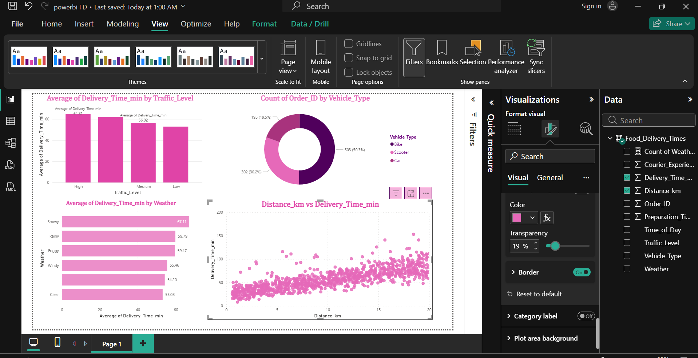

Food Delivery Times Analysis Dashboard | Power BI
Power BI project focused on food delivery time analysis with interactive visualizations and business insights.
# Food Delivery Times Analysis Dashboard | Power BI

## Dashboard Preview

## Project Overview

This Power BI dashboard analyzes food delivery performance using a Food Delivery Times dataset.

### Key Insights
- Average Delivery Time by Traffic Level
- Delivery Performance by Weather Conditions
- Vehicle Type Distribution
- Distance vs Delivery Time Analysis

### Tools Used
- Power BI
- Data Analysis
- Data Visualization
